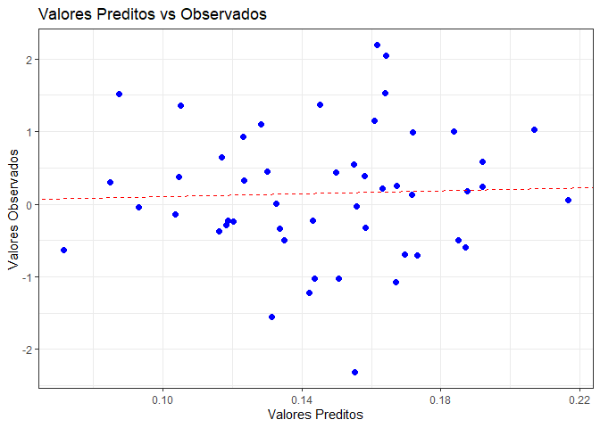

<!-- README.md is generated from README.Rmd. Please edit that file -->

# regressao

<!-- badges: start -->
<!-- badges: end -->

O objetivo do pacote `regressao` é realizar uma regressão linear,
estimando os coeficientes e obtendo valores preditos, resíduos e um
gráfico de dispersão (Valores Preditos vs. Valores Observados)

## Instalação

É possível instalar o pacote `regressao` através do link
[GitHub](https://github.com/) com:

``` r
# install.packages("pak")
pak::pak("VKauling9/Regressao918")
```

## Exemplo

Este é um exemplo básico que mostra como aplicar a função regressao do
pacote `regressao`:

``` r
library(regressao)

modelo <- regressao("sim_Y", "sim_X", sim_dados)

modelo$Betas
#>             sim_Y
#>        0.14761510
#> sim_X -0.03507862
head(modelo$Valores_preditos)
#>           sim_Y
#> [1,] 0.16727581
#> [2,] 0.15568941
#> [3,] 0.09293776
#> [4,] 0.14514176
#> [5,] 0.14307986
#> [6,] 0.08745299
head(modelo$Residuos)
#>            sim_Y
#> [1,]  0.08604271
#> [2,] -0.18423616
#> [3,] -0.13580822
#> [4,]  1.22346052
#> [5,] -0.36885085
#> [6,]  1.42901762
```

Já a função predicao pode ser utilizada, após a execução da função acima
salvando-a em um objeto, da seguinte forma:

``` r
predicao(0.6, modelo)
#>           [,1]
#> [1,] 0.1265679
```

Exemplo de chamado referente ao modelo ajustado acima:

